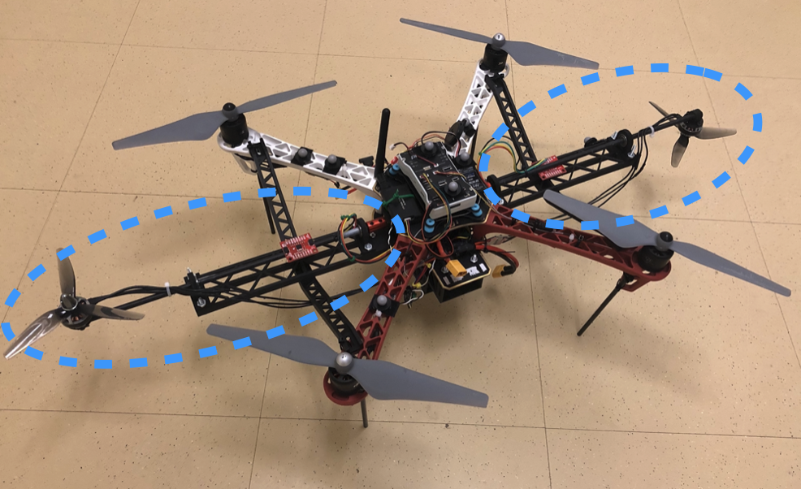
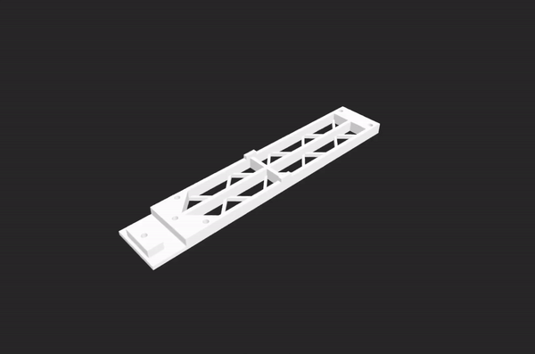
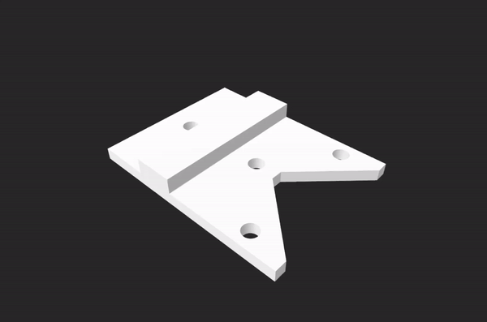
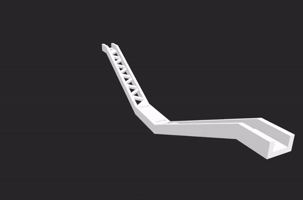
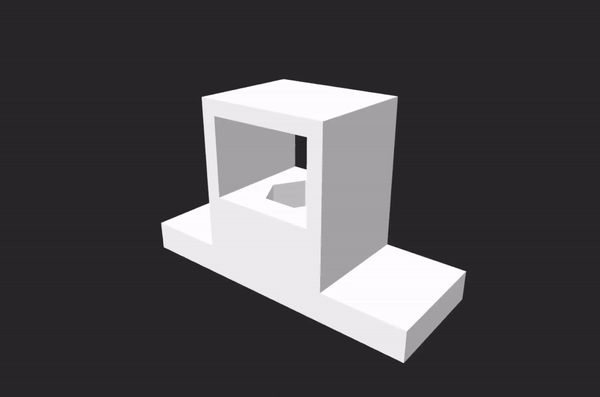
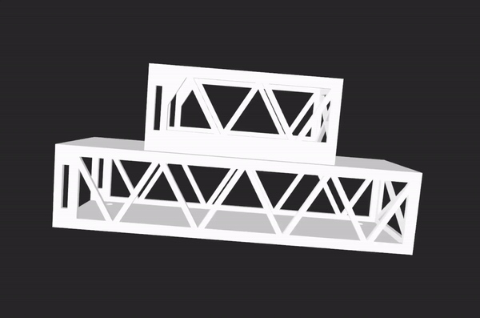
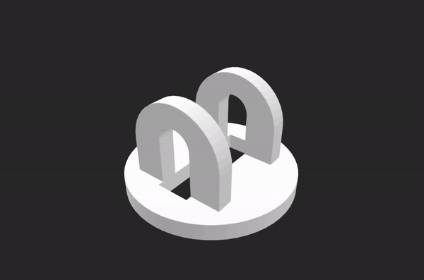
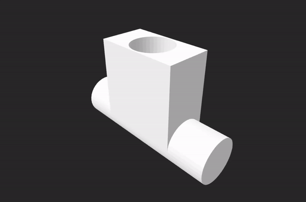

# Physical Design

This provides both the SOLIDWORKS and SDL files used to 3D print our haptic suit. Each of these were developed to connect DJI Flame Wheel F450. We provide the following:
* Haptic suit arm
* Battery holder
* Pendulum

## Haptic Suit Arm

The blue dashed lines show two arms. To print each arm you can use the following components:

### Arm

This is the main structure that extends outwards from the body of the drone.

### Arm Clip

This clips between the arm and the frame, to lock the arm to the frame of the quadrotor.

### Arm Support

This connects to each of the quadrotor arms to add additional support

### Arm Motor Holder

This sits at the beginning of the arm, and holds the motor used to rotate the direction of the force generated.

## Battery Holder

The battery holder sits underneath the drone and holds the battery for both the haptic suit and the quadrotor.

## Pendulum

The pendulum used in the study was also 3D printed. It consists of two parts. 

### Hinge

First the hinge which is that attached to the drone.

### Connector

Second the connector which sits inside the hinge.

